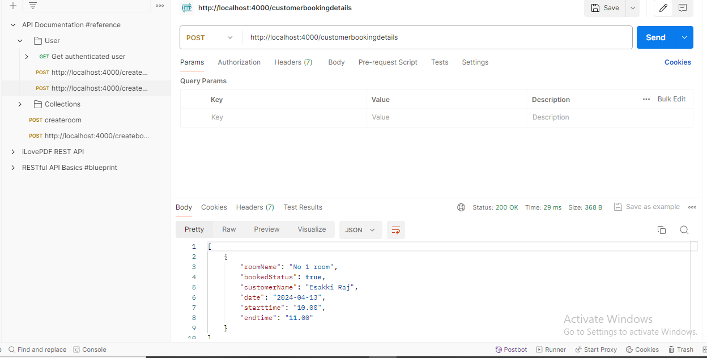
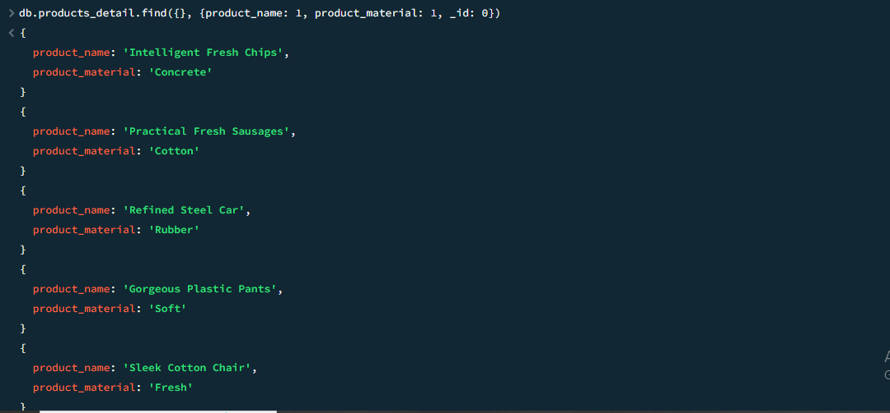
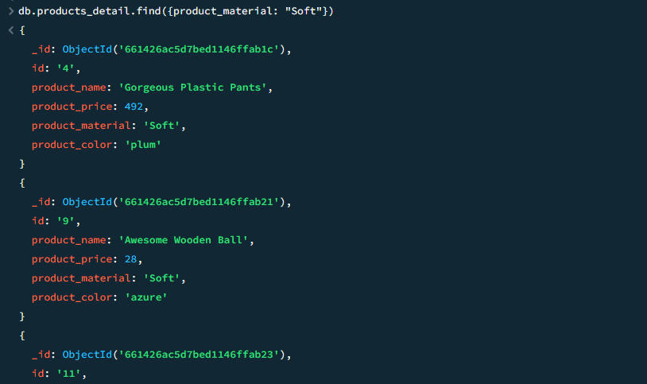

## Database- Day -3: MongoDB   

**MongoDB Query task**   

 - I have mentioned all queries and output in this file.

 - I have completed and submitted Query task, kindly check and verify it.   

 - I have attached `Output image` for your reference  

  - 1. Find all the information about each products

    ``` bash
    db.products_detail.find()
    ```
**Output:**

 

 - 2. Find the product price which are between 400 to 800

    ``` bash
    db.products_detail.find({ product_price: { $gt: 400, $lt: 800 }})
    ```
**Output:**

 

 - 3. Find the product price which are not between 400 to 600

    ``` bash
    db.products_detail.find({ product_price: {$not: { $gt: 400, $lt: 800 }}})
    ```
**Output:**

 

  - 4. List the four product which are greater than 500 in price 

    ``` bash
    db.products_detail.find({product_price: {$gt: 500}}).limit(4)
    ```
**Output:**

 

  - 5. Find the product name and product material of each products

    ``` bash
    db.products_detail.find({}, {product_name: 1, product_material: 1, _id: 0})
    ```
**Output:**

 

 - 6. Find the product with a row id of 10

    ``` bash
    db.products_detail.find({id: "10"})
    ```
**Output:**

 

 - 7. Find only the product name and product material

    ``` bash
    db.products_detail.find({}, {product_name: 1, product_material: 1, _id: 0})
    ```
**Output:**

 

 - 8. Find all products which contain the value of soft in product material 

    ``` bash
    db.products_detail.find({product_material: "Soft"})
    ```
**Output:**

 

 - 9. Find products which contain product color indigo  and product price 492.00

    ``` bash
    db.products_detail.find({product_color: "indigo", product_price: 492})
    ```
**Output:**

 There is no records found in this documents.

 - 10. Delete the products which product price value are 28

    ``` bash
    db.products_detail.remove({product_price: 28})
    ```
