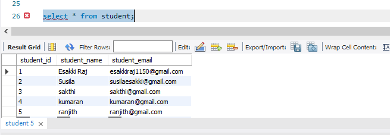
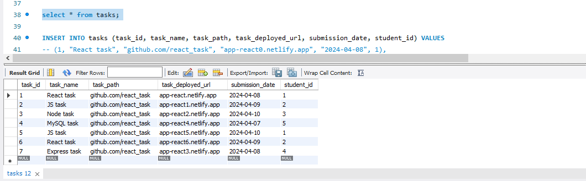
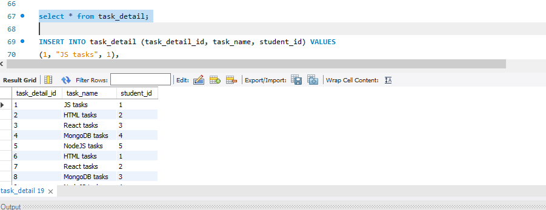
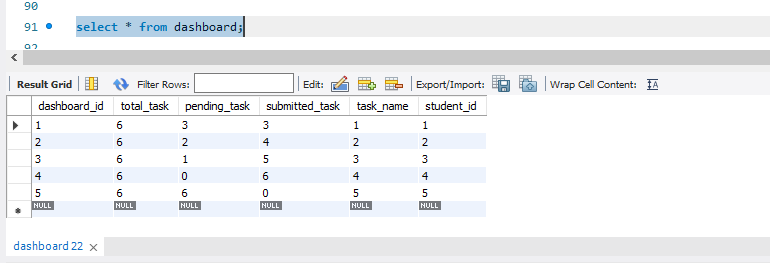
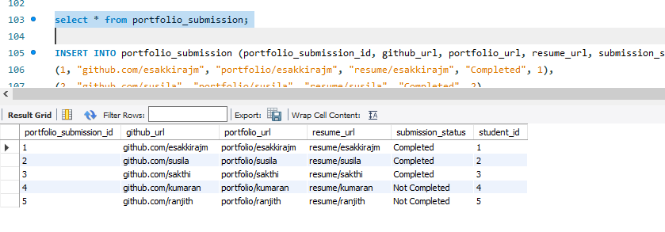
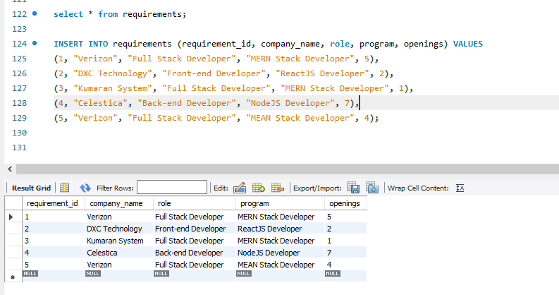

## Database- Day -2: MySQL   

**Design DB model for Guvi Zen class**   

 - I have mentioned all queries in this file.

 - I have completed and submitted Design DB model task, kindly check and verify it.   

 - I have attached `Output image` for your reference  

 - #### student table:   

**create query:**

``` bash
CREATE TABLE student (
	student_id INT PRIMARY KEY,
    student_name VARCHAR(50),
    student_email VARCHAR(50)
);
```

**insert query:**

``` bash
INSERT INTO student (student_id, student_name, student_email) VALUES 
(1, "Esakki Raj", "esakkiraj1150@gmail.com"),
(2, "Susila", "susilaesakki@gmail.com"),
(3, "sakthi", "sakthi@gmail.com"),
(4, "kumaran", "kumaran@gmail.com"),
(5, "ranjith", "ranjith@gmail.com")
```

**Output:**

 ``` bash 
    select * from student;
```

 

 - #### task table:   

**create query:**

``` bash
CREATE TABLE tasks (
	task_id INT PRIMARY KEY,
    task_name VARCHAR(100),
    task_path VARCHAR(200),
    task_deployed_url VARCHAR(200),
    submission_date DATE,
    student_id INT,
    FOREIGN KEY (student_id) REFERENCES student(student_id)
);
```

**insert query:**

``` bash
INSERT INTO tasks (task_id, task_name, task_path, task_deployed_url, submission_date, student_id) VALUES 
(1, "React task", "github.com/react_task", "app-react0.netlify.app", "2024-04-08", 1),
(2, "JS task", "github.com/react_task", "app-react1.netlify.app", "2024-04-09", 2),
(3, "Node task", "github.com/react_task", "app-react2.netlify.app", "2024-04-10", 3),
(4, "MySQL task", "github.com/react_task", "app-react4.netlify.app", "2024-04-07", 5),
(5, "JS task", "github.com/react_task", "app-react5.netlify.app", "2024-04-10", 1),
(6, "React task", "github.com/react_task", "app-react6.netlify.app", "2024-04-09", 2),
(7, "Express task", "github.com/react_task", "app-react3.netlify.app", "2024-04-08", 4)
```

**Output:**

 ``` bash 
    select * from tasks;
```

 

- #### task_detail table:   

**create query:**

``` bash
CREATE TABLE task_detail (
	task_detail_id INT PRIMARY KEY,
    task_name VARCHAR(200),
    student_id INT,
    FOREIGN KEY (student_id) REFERENCES student(student_id)
)
```

**insert query:**

``` bash
INSERT INTO task_detail (task_detail_id, task_name, student_id) VALUES 
(1, "JS tasks", 1),
(2, "HTML tasks", 2),
(3, "React tasks", 3),
(4, "MongoDB tasks", 4),
(5, "NodeJS tasks", 5),
(6, "HTML tasks", 1),
(7, "React tasks", 2),
(8, "MongoDB tasks", 3),
(9, "NodeJS tasks", 4),
(10, "MySQL tasks", 5)
```

**Output:**

 ``` bash 
    select * from task_detail;
```

 

- #### dashboard table:    

**create query:**

``` bash
CREATE TABLE dashboard (
	dashboard_id INT PRIMARY KEY,
    total_task INT,
    pending_task INT,
    submitted_task INT,
    task_name INT, 
	student_id INT,
    FOREIGN KEY (task_name) REFERENCES task_detail(task_detail_id),
    FOREIGN KEY (student_id) REFERENCES student(student_id)
);
```

**insert query:**

``` bash
INSERT INTO dashboard (dashboard_id, total_task, pending_task, submitted_task, task_name, student_id) VALUES
(1, 6, 3, 3, 1, 1),
(2, 6, 2, 4, 2, 2),
(3, 6, 1, 5, 3, 3),
(4, 6, 0, 6, 4, 4),
(5, 6, 6, 0, 5, 5);
```

**Output:**

 ``` bash 
    select * from dashboard;
```

 

 - #### portfolio_submission table:   

**create query:**

``` bash
CREATE TABLE portfolio_submission (
	portfolio_submission_id INT,
    github_url VARCHAR(250),
    portfolio_url VARCHAR(250),
    resume_url VARCHAR(250),
    status VARCHAR(150),
    student_id INT,
    FOREIGN KEY student_id REFERENCES student(student_id)
);
```

**insert query:**

``` bash
INSERT INTO portfolio_submission (portfolio_submission_id, github_url, portfolio_url, resume_url, submission_status, student_id) VALUES
(1, "github.com/esakkirajm", "portfolio/esakkirajm", "resume/esakkirajm", "Completed", 1),
(2, "github.com/susila", "portfolio/susila", "resume/susila", "Completed", 2),
(3, "github.com/sakthi", "portfolio/sakthi", "resume/sakthi", "Completed", 3),
(4, "github.com/kumaran", "portfolio/kumaran", "resume/kumaran", "Not Completed", 4),
(5, "github.com/ranjith", "portfolio/ranjith", "resume/ranjith", "Not Completed", 5)
```

**Output:**

 ``` bash 
    select * from portfolio_submission;
```

 

 - #### requirements table:   

**create query:**

``` bash
CREATE TABLE requirements (
	requirement_id INT PRIMARY KEY,
    company_name VARCHAR(150),
    role VARCHAR(100),
    program VARCHAR(100),
    openings INT
);
```

**insert query:**

``` bash
INSERT INTO requirements (requirement_id, company_name, role, program, openings) VALUES 
(1, "Verizon", "Full Stack Developer", "MERN Stack Developer", 5),
(2, "DXC Technology", "Front-end Developer", "ReactJS Developer", 2),
(3, "Kumaran System", "Full Stack Developer", "MERN Stack Developer", 1),
(4, "Celestica", "Back-end Developer", "NodeJS Developer", 7),
(5, "Verizon", "Full Stack Developer", "MEAN Stack Developer", 4);
```

**Output:**

 ``` bash 
    select * from requirements;
```

 