## Database- Day -1: MySQL   

**MySQL Query task**   

 - I have mentioned all queries in this file.

 - I have completed and submitted Query task, kindly check and verify it.   

 - I have attached `Output image` for your reference  

  - 1. Find the title of each film

    ``` bash
    SELECT title FROM movies;
    ```
**Output:**

 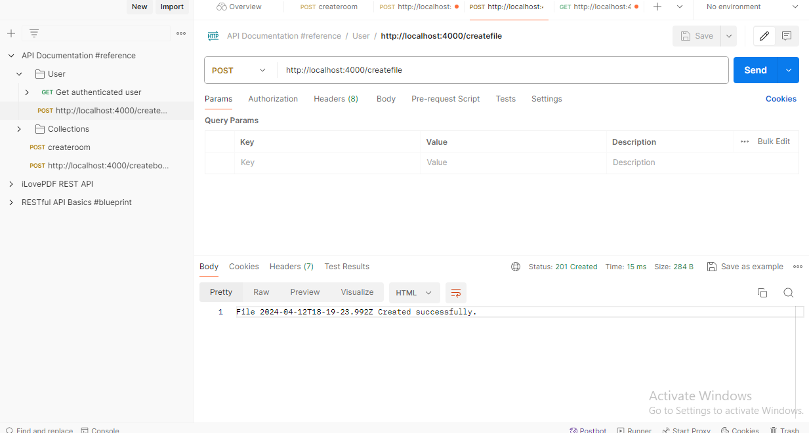

 - 2. Find the director of each film 

    ``` bash
    SELECT director FROM movies;
    ```
**Output:**

 

 - 3. Find the title and director of each film

    ``` bash
    SELECT title, director FROM movies;
    ```
**Output:**

 

  - 4. Find the title and year of each film

    ``` bash
    SELECT title, year FROM movies;
    ```
**Output:**

 

  - 5. Find all the information about each film

    ``` bash
    SELECT * FROM movies;
    ```
**Output:**

 

 - 6. Find the movie with a row id of 6

    ``` bash
    SELECT * FROM movies where id=6;
    ```
**Output:**

 

 - 7. Find the movies released in the years between 2000 and 2010

    ``` bash
    SELECT * FROM movies where year between 2000 and 2010;
    ```
**Output:**

 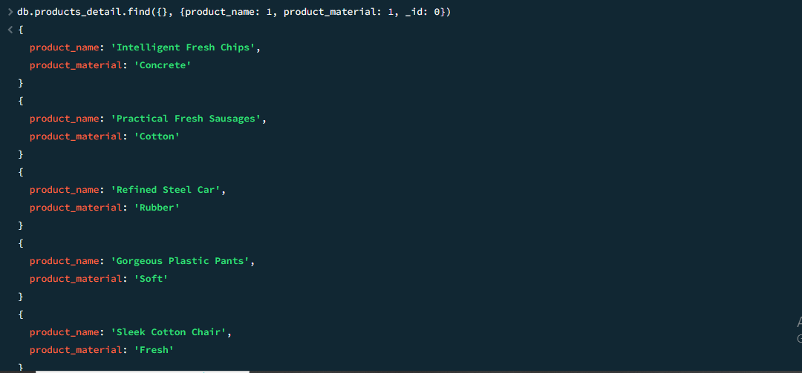

 - 8. Find the movies not released in the years between 2000 and 2010 

    ``` bash
    SELECT * FROM movies where not year between 2000 and 2010;
    ```
**Output:**

 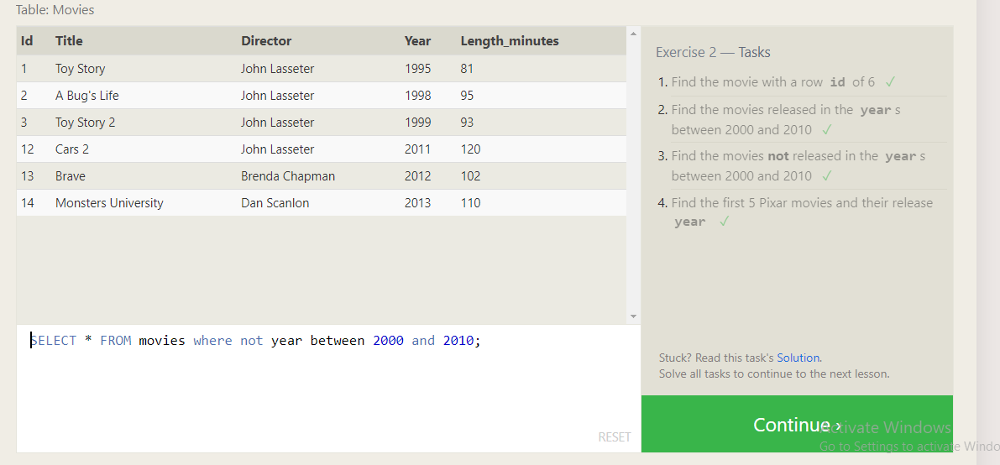

 - 9. Find the first 5 Pixar movies and their release year

    ``` bash
    SELECT * FROM movies where id between 1 and 5 order by year;
    ```
**Output:**

 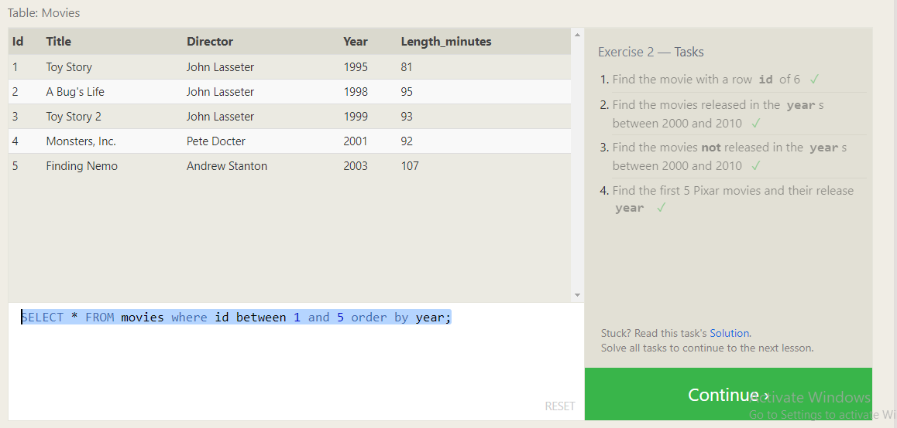

 - 10. Find all the Toy Story movies

    ``` bash
    SELECT * FROM movies where title like 'toy story%'
    ```
**Output:**

 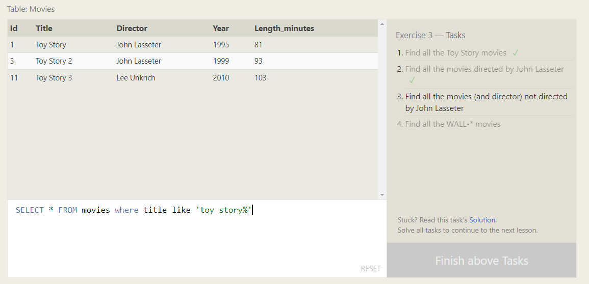

 - 11. Find all the movies directed by John Lasseter

    ``` bash
    SELECT * FROM movies where director= "John Lasseter";
    ```
**Output:**

 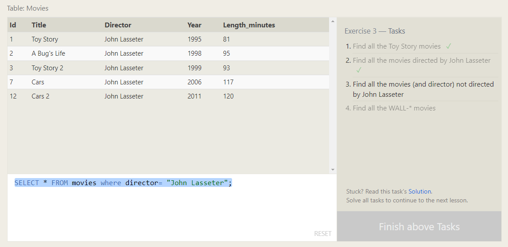

 - 12. Find all the movies (and director) not directed by John Lasseter

    ``` bash
    SELECT * FROM movies where not director= "John Lasseter";
    ```
**Output:**

 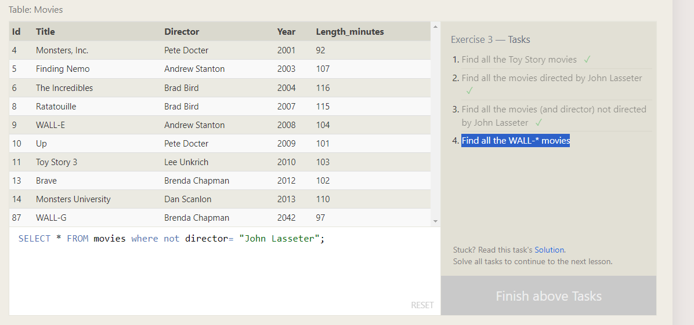

- 13. Find all the WALL-* movies

    ``` bash
    SELECT * FROM movies where title like 'wall%';
    ```
**Output:**

 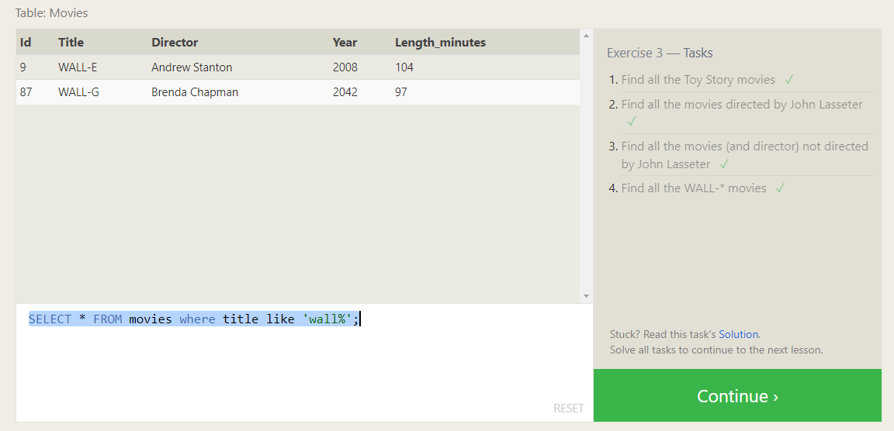

 - 14. List all directors of Pixar movies (alphabetically), without duplicates

    ``` bash
    SELECT distinct director FROM movies order by director asc;
    ```
**Output:**

 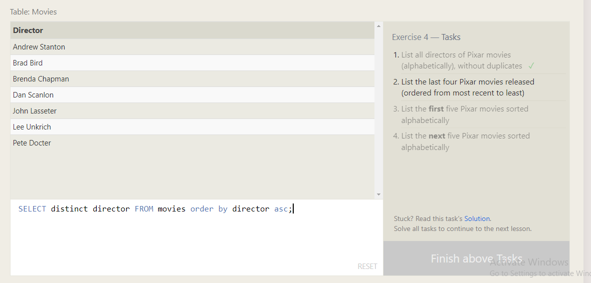

 - 15. List the last four Pixar movies released (ordered from most recent to least)

    ``` bash
    SELECT * FROM movies order by year desc limit 4;
    ```
**Output:**

 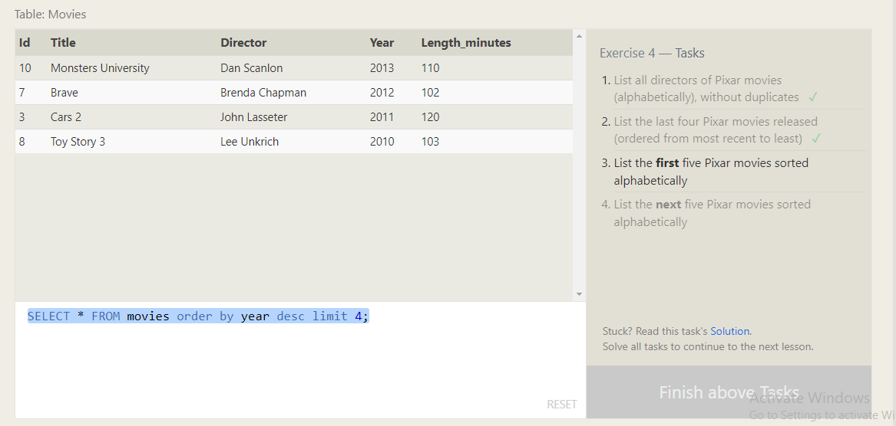

 - 16. List the first five Pixar movies sorted alphabetically 

    ``` bash
    SELECT * FROM movies order by title limit 5;
    ```
**Output:**

 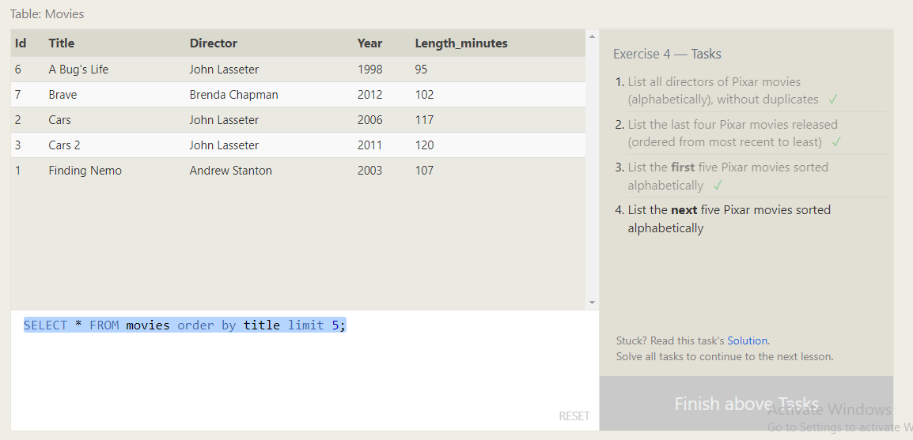

 - 17. List the next five Pixar movies sorted alphabetically

    ``` bash
    SELECT * FROM movies order by title limit 5 offset 5;
    ```
**Output:**

 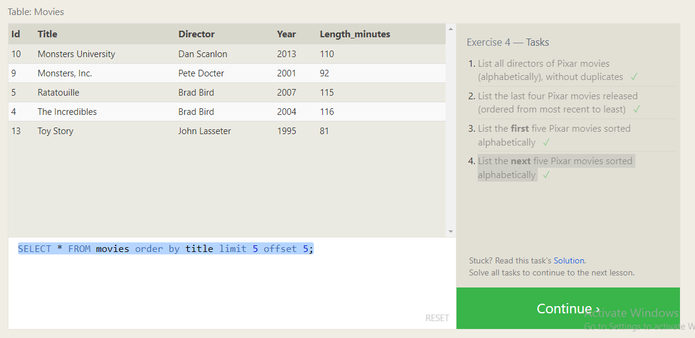

 - 18. List all the Canadian cities and their populations 

    ``` bash
    SELECT * FROM north_american_cities where country ='Canada';
    ```
**Output:**

 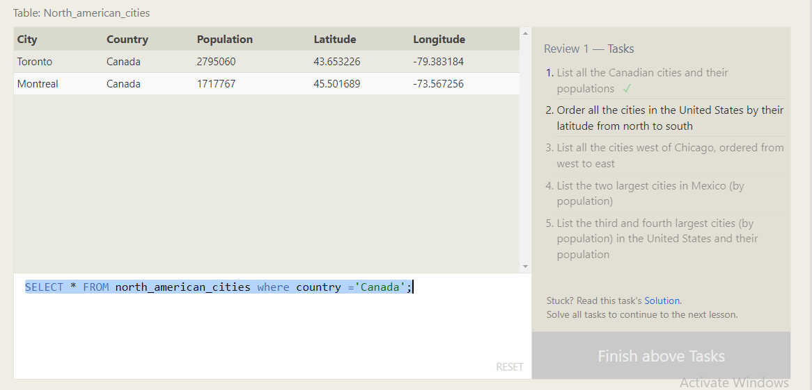

 - 19. Order all the cities in the United States by their latitude from north to south

    ``` bash
    SELECT * FROM north_american_cities where country ='United States' order by latitude desc;
    ```
**Output:**

 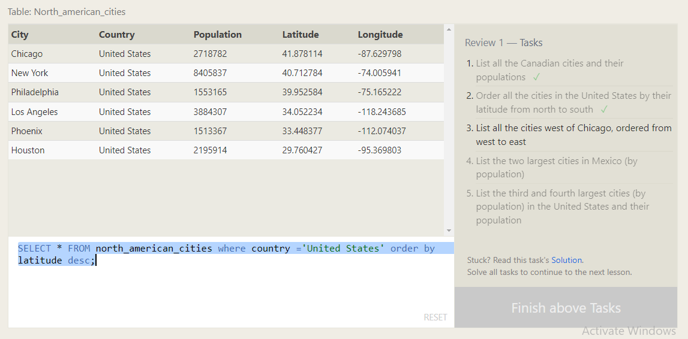

 - 20. List all the cities west of Chicago, ordered from west to east

    ``` bash
    SELECT city, longitude FROM north_american_cities
    WHERE longitude < -87.629798
    ORDER BY longitude ASC;
    ```
**Output:**

 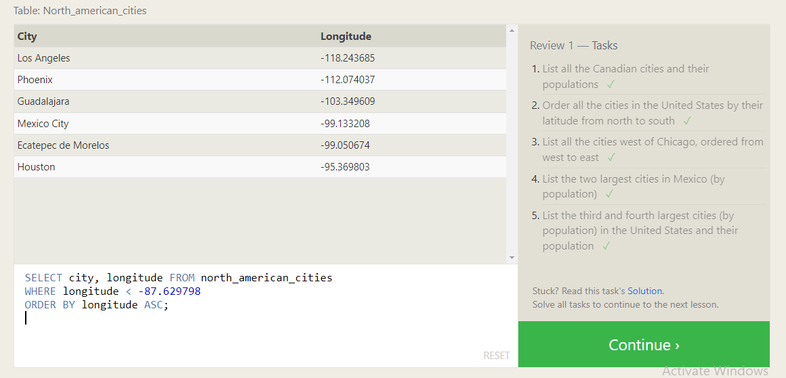

 - 21. List the third and fourth largest cities (by population) in the United States and their population 

    ``` bash
    SELECT city, population FROM north_american_cities
    WHERE country LIKE "United States"
    ORDER BY population DESC
    LIMIT 2 OFFSET 2;
    ```
**Output:**

 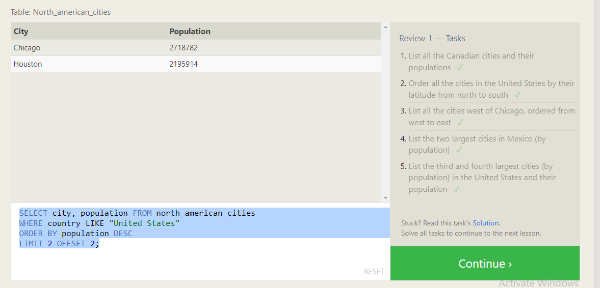

 - 22. List the two largest cities in Mexico (by population) 

    ``` bash
    SELECT * from north_american_cities where country ='Mexico' order by population desc limit 2;
    ```
**Output:**

 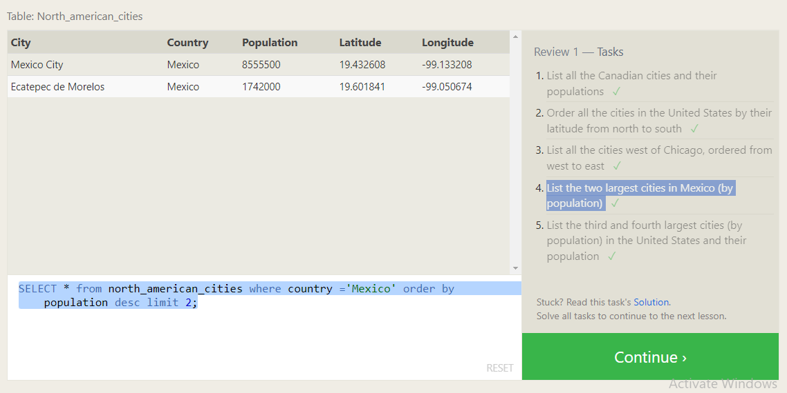

 - 23. Find the domestic and international sales for each movie

    ``` bash
    select movies.title, boxoffice.domestic_sales, boxoffice.international_sales from movies left join boxoffice on movies.id = boxoffice.movie_id
    ```
**Output:**

 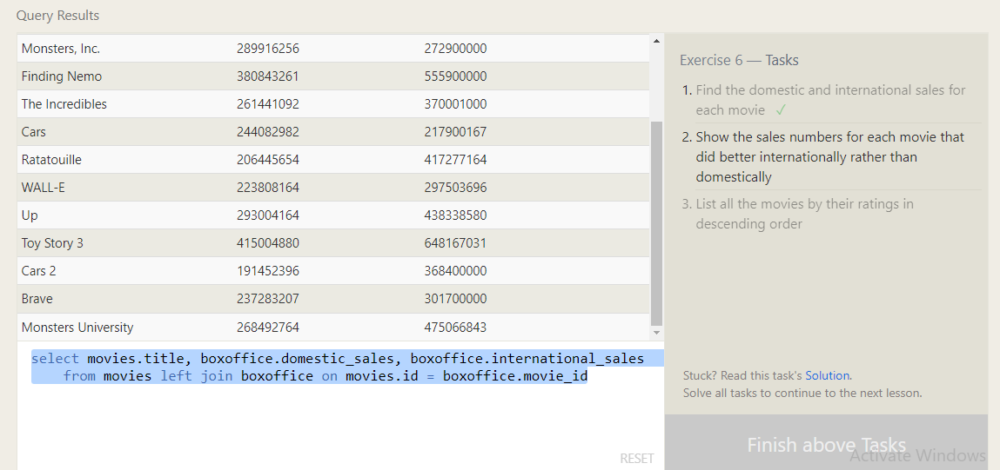

 - 24. Show the sales numbers for each movie that did better internationally rather than domestically

    ``` bash
    select movies.id, movies.title, movies.director, boxoffice.international_sales, boxoffice.domestic_sales
    from movies join boxoffice on movies.id = boxoffice.movie_id where boxoffice.domestic_sales < boxoffice.international_sales
    ```
**Output:**

 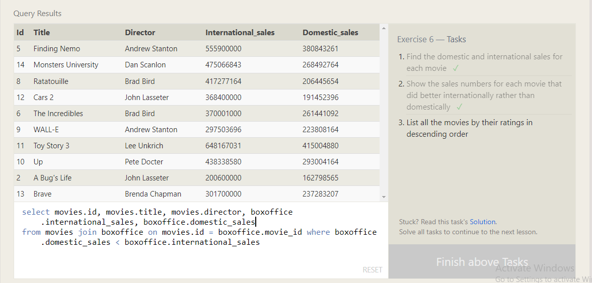

 - 25. List all the movies by their ratings in descending order 

    ``` bash
    select movies.title, movies.director, boxoffice.rating from movies
    join boxoffice on movies.id = boxoffice.movie_id order by rating desc;
    ```
**Output:**

 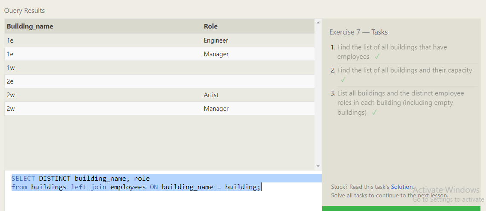

 - 26. Find the list of all buildings that have employees 

    ``` bash
    SELECT DISTINCT building FROM employees;
    ```
**Output:**

 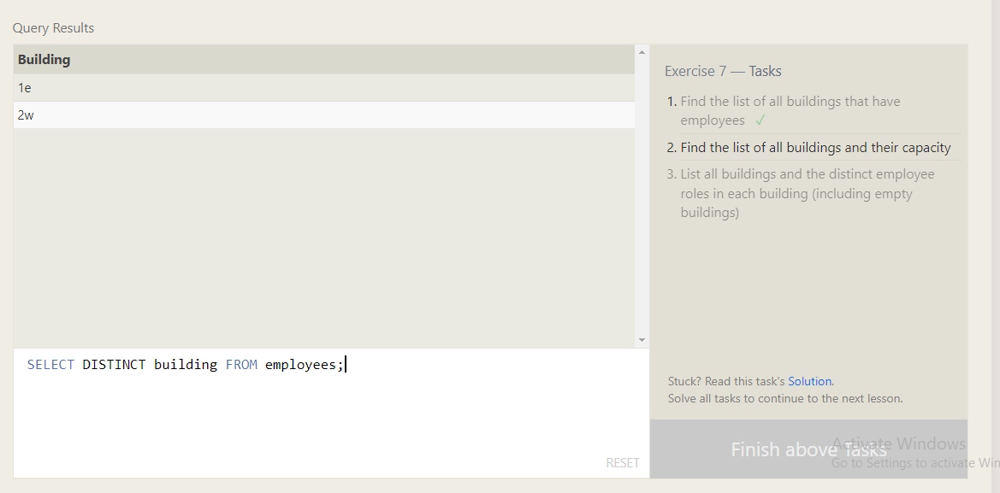

 - 27. Find the list of all buildings and their capacity

    ``` bash
    SELECT * FROM buildings;
    ```
**Output:**

 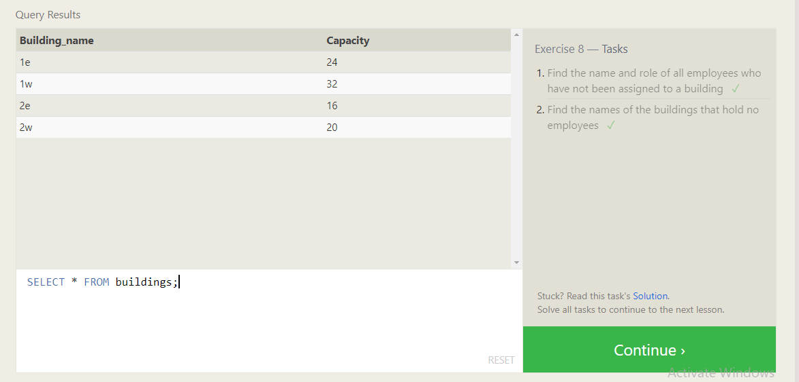

 - 28. List all buildings and the distinct employee roles in each building (including empty buildings)

    ``` bash
    SELECT DISTINCT building_name, role 
    from buildings left join employees ON building_name = building;
    ```
**Output:**

 

 - 29. Find the name and role of all employees who have not been assigned to a building 

    ``` bash
    SELECT * FROM employees where building is null;
    ```
**Output:**

 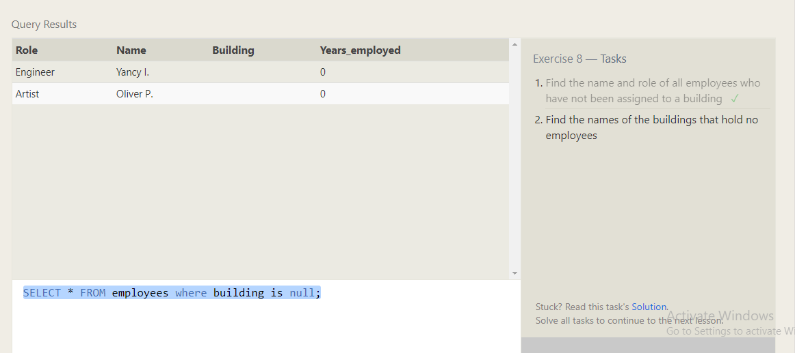

 - 30. Find the names of the buildings that hold no employees

    ``` bash
    SELECT DISTINCT building_name
    FROM buildings 
    LEFT JOIN employees
    ON building_name = building
    WHERE role IS NULL;
    ```
**Output:**

 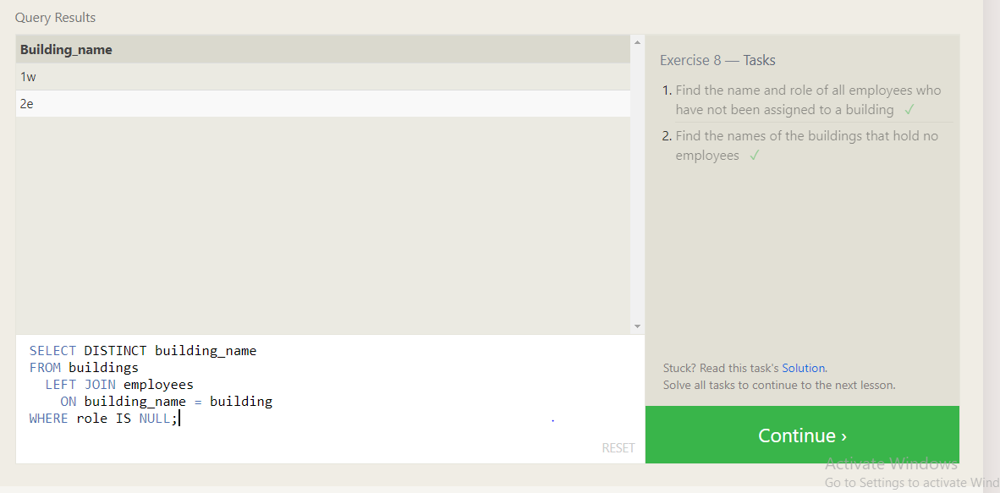


