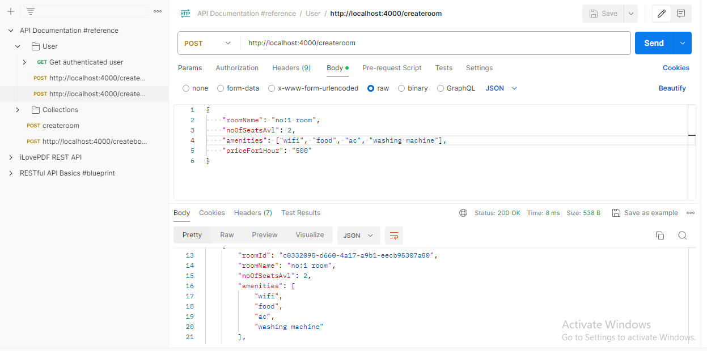
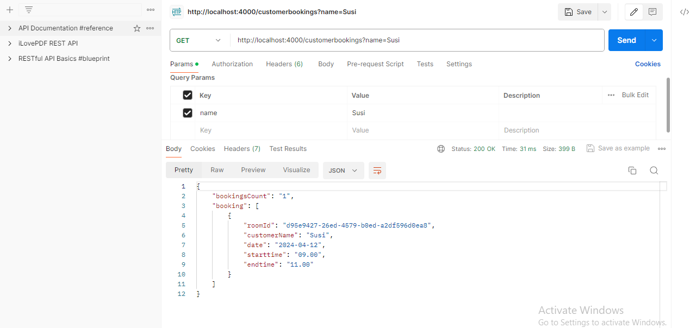

## Nodejs- Day -2: Nodejs & Express.js    

**NodeJS hall booking api task**   

 - I have mentioned all queries and output in this file.

 - I have completed and submitted NodeJS hall booking task, kindly check and verify it.   

  - I using ExpressJS in this task

 - I have attached `Output image` for your reference  

 - Use the following URL's to get a output in for this task(use the postman API)

 **Question doc:** https://docs.google.com/document/d/1rwPQ2LbHtMZajA_GIZfR-Ko2MFueoT82AmfHTK9V-hM/edit

  - local download:

  - Run the command in terminal to get a dependencies

    ``` bash
    npm i
    ```
  - Start the server

     ``` bash
    npm start
    ```   

 - 1. Creating room:

 - This command to create a room booking

    ``` bash
    https://hallbookingapi-8yl5.onrender.com/createroom
    ```
    
**Output:**

 

 - 2. Booking room:

 - This command to book the room
    ``` bash
    https://hallbookingapi-8yl5.onrender.com/bookingroom
    ```
    
**Output:**

 

 - 3. List all rooms with booked data:

 - This command to get the customer room booking details

    ``` bash
    https://hallbookingapi-8yl5.onrender.com/customerbookingdetails
    ```
    
**Output:**

 

 - 4. List all rooms with booked data:

 - This command to get the all rooms with booked data

    ``` bash
    https://hallbookingapi-8yl5.onrender.com/allcustomers
    ```
    
**Output:**

 

  - 5. List customer booking count

  - - This command to get the cutomer booking count

    ``` bash
    https://hallbookingapi-8yl5.onrender.com/customerbookings?name=Susi
    ```
    
**Output:**

 


