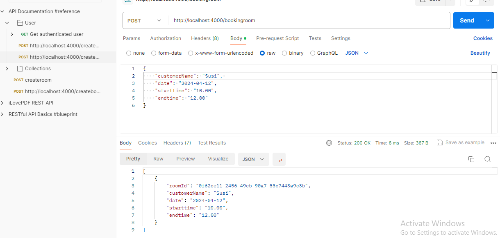

## Nodejs- Day -1: Nodejs   

**NodeJS File System task**   

 - I have completed and submitted NodeJS File system task, kindly check and verify it.   

 - I using ExpressJS in this task

 - I have attached `Output image` for your reference  

 - local download:

  - Run the command in terminal to get a dependencies

    ``` bash
    npm i
    ```
  - Start the server

     ``` bash
    npm start
    ```   

 - 1. Write API endpoint which will create a text file in a particular folder

    ``` bash
    http://localhost:4000/createfile
    ```
    
**Output:**

 

 - 2. Write API endpoint to retrieve all the text files in that particular folder

    ``` bash
    http://localhost:4000/textfiles
    ```
    
**Output:**

 


