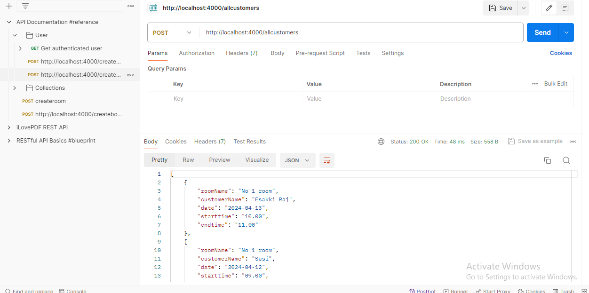

 ## Database- Day -4: MongoDB   

**MongoDB Query task**   

 - I have mentioned all queries and output in this file.

 - I have completed and submitted Query task, kindly check and verify it.   

 - I have attached `Output image` for your reference  

  - 1. Find all the topics and tasks which are thought in the month of October

  **query 1:**

    ``` bash
    db.topics.find({month: "October"})
    ```
**Output:**

 

  **query 1:**

    ``` bash
    db.tasks.find({month: "October"})
    ```
**Output:**

 

 - 2. Find all the company drives which appeared between 15 oct-2020 and 31-oct-2020

    ``` bash
    db.company_drives.find( {date: {$gte: ISODate("2020-10-15"), $lte: ISODate("2020-10-31") } } )
    ```
**Output:**

 

 - 3. Find all the company drives and students who are appeared for the placement

 **Aggregate:**

    ``` bash
    {
  from: "users",
  localField: "_id",
  foreignField: "placement_id",
  as: "appeared for the placment",
  }
    ```
**Output:**

 

 - 4. Find the number of problems solved by the user in codekata

    ``` bash
     {
	_id: "$_id",
	problem_solved: { $avg: "$no_of_problem_solved" }
     }

    ```
**Output:**

 

 - 5. Find all the mentors with who has the mentee's count more than 15

    ``` bash
     db.mentors.aggregate([
  {
    $lookup: {
      from: "users",
      localField: "_id",
      foreignField: "mentor_id",
      as: "mentees"
    }
  },
  {
    $addFields: {
      menteeCount: { $size: "$mentees" }
    }
  },
  {
    $match: {
      menteeCount: { $gt: 15 }
    }
  }
 ]);
    ```
**Output:**

 

 - 6. Find the number of users who are absent and task is not submitted  between 15 oct-2020 and 31-oct-2020

    ``` bash
     db.attendance.aggregate([
  {
    $match: {
      date: {
        $gte: ISODate("2020-10-15"),
        $lte: ISODate("2020-10-31")
      },
      status: "absent",
      task_submitted: false
    }
  },
  {
    $group: {
      _id: null,
      count: { $sum: 1 }
    }
  }
  ]);
    ```
**Output:**

 